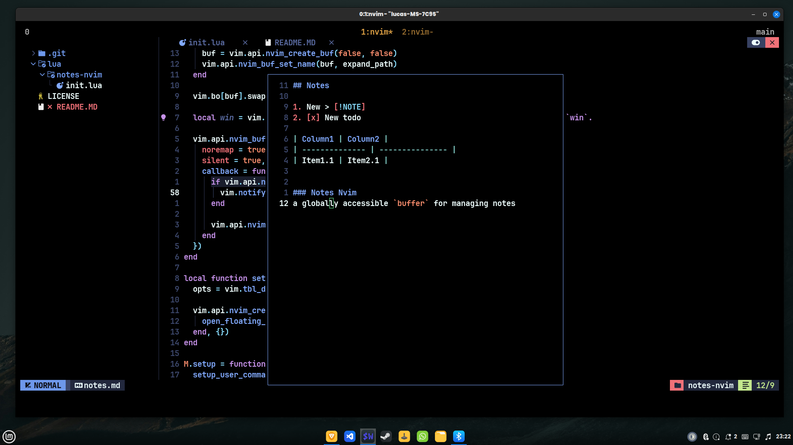

# 📝 Notes Nvim

A lightweight, globally accessible floating buffer for quick note-taking in Neovim. Perfect for daily todos, quick thoughts, or in-context reminders — all in one Markdown file.



## ✨ Features

- 📄 Opens your notes in a floating window, centered on screen
- 🧠 Ideal for quick todos, thoughts, and reminders
- 💾 Automatically writes to a markdown file of your choice
- 🧱 Configurable border styles (`single`, `rounded`, etc.)
- ❌ `q` to close, with unsaved changes warning

---

## 🚀 Installation (using [lazy.nvim](https://github.com/folke/lazy.nvim))

```lua
return {
  "Cunegundess/notes-nvim",
  config = function()
    require("notes-nvim").setup({
      target_file = "~/notes/notes.md",
      border = "single" -- or "rounded"
    })
  end
}
```


## 🛠 Usage
Once installed, simply run:

```vim
:Notes
```
This will open your configured notes.md in a floating window. You can begin typing immediately.

Press `q` to close the window. If there are unsaved changes, a warning will be shown.


## 🤝 Contributing
Pull requests and issues are welcome! Let's make Neovim note-taking smoother together.
